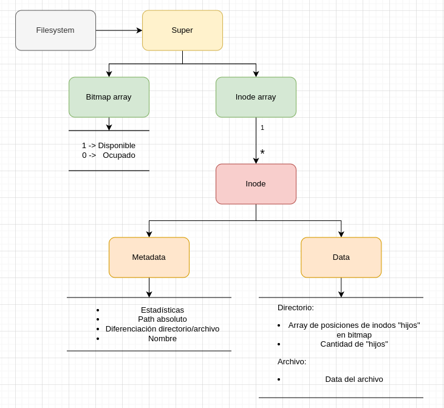

# Fisopfs
## Implementación

Nuestra implementacion del sistema de archivos se basa en estructuras de datos. Tomamos como influencia el sistema de archivos de Unix, donde se tiene un inodo con la metadata del archivo. En nuestro caso, tenemos la estructura de *inode* , que ademas de contener la metadata del archivo en si, contiene la data del archivo. En el caso de los directorios, tenemos un atributo dentro de la estructura de inodos, que representa las posiciones y la cantidad de hijos que el mismo contiene. La posicion de los hijos se usa en otra estructura llamada super: En dicha estructura nosotros tenemos dos atributos, un arreglo de inodos y un arreglo bitmap. Por un lado, el arreglo de bitmap representa, atraves de 1 y 0 si una posicion dentro del arreglo de inodos se encuentra usada(0) o disponible(1). Por otro lado, con el dato del bitmap, con esa misma posicion podemos acceder al arreglo de inodos, obteniendo el inodo y toda su metadata. Por ejemplo, en la posicion 0 se encuentra el inodo raiz, que se encuentra siempre usado. A través del bitmap no hace falta eliminar la metadata del inodo anterior ya que con marcar el inodo como disponible, eliminamos todo rastro de el, para que en una proxima iteración se guarde otro inodo en dicho lugar. A su vez, tenemos un atributo dentro de los inodos llamado path absoluto, diferenciandose asi de otros inodos y poder tener dos archivos en diferentes paths. 

## Persistencia
Para la persistencia utilizamos un archivo donde guardamos primero los directorios conocidos por el filesystem, y luego todos los otros archivos con su metadata.
Para saber donde empiezan los archivos solamente lo marcamos con ;
Un ejemplo podria ser:
/

/nuevo

/hola

;

/archivo.txt: hola este es un archivo

;

/archivo2.txt: hola este es otro archivo

;

En este caso, nuevo y hola serian dos directorios dentro del root y los dos archivos tambien vivirán en root con su respectiva data.

