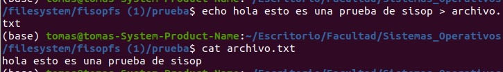
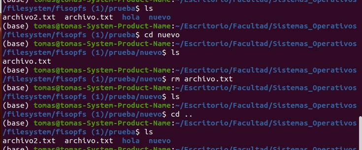

PRUEBAS DE TP:

# Listar archivos en root vacío:

# Crear un root y listar:

# Listar archivos en root después de borrar un directorio:

# Listar archivos en root después crear un archivo:

# Listar archivos en root después crear un archivo y un directorio:

# Listar el contenido de un archivo vacio:

# Listar el contenido de un archivo:

# Listar el contenido de dos archivos:

# Listar el contenido de un archivo dentro de otro directorio:

# Listar el contenido de dos archivo dentro de dos directorios distintos:

# Borrar un archivo dentro de un subdirectorio:

# Listar el contenido de un archivo luego de appendear algo:

# Persistencia:

